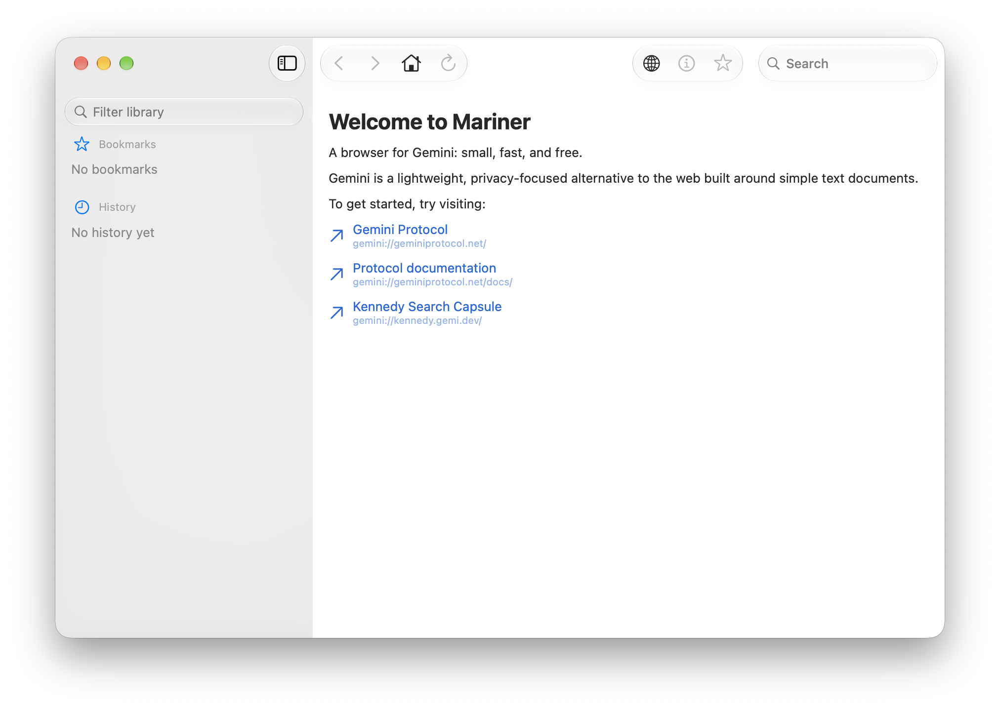

# Mariner

A native macOS browser for the Gemini protocol, built with SwiftUI.

## Features

- **Gemini browsing** — fetches and renders `text/gemini` as styled gemtext; other
  text renders as plain text; images and binary files show a preview/download page.
- **TOFU certificate trust** — pins server certificates on first use and warns on
  mismatch, with per-host handling.
- **Client identities** — import PKCS#12 (.p12) client certificates, stored securely
  in the Keychain, for hosts that require them.
- **Bookmarks & history** — persistent bookmark sidebar and browsing history.
- **Per-host settings** — customize trust and display preferences per capsule.
- **Find in page** and adjustable text zoom (`⌘+` / `⌘-` / `⌘0`).
- **Natural macOS experience** — real menus and keyboard shortcuts (Back/Forward `⌘[`
  / `⌘]`, Reload `⌘R`, Home `⇧⌘H`, Find `⌘F`, Bookmark `⌘D`, Save `⌘S`).

## Installation

TBD.

## Requirements

- macOS 26.0 (Tahoe) or later

## Contributing

See [CONTRIBUTING.md](./CONTRIBUTING.md) for setup instructions,
architecture notes, and contribution guidelines.

# License

Code is licensed under the Apache 2.0 license. See the [LICENSE](./LICENSE) file for details.
Digital artwork is licensed under the Creative Commons Attribution-ShareAlike 4.0 International license. See the [LICENSE-CC-BY-SA](./LICENSE-CC-BY-SA) for details.

---

Made with ❤️. Fueled by ☕️ and 🤖.
